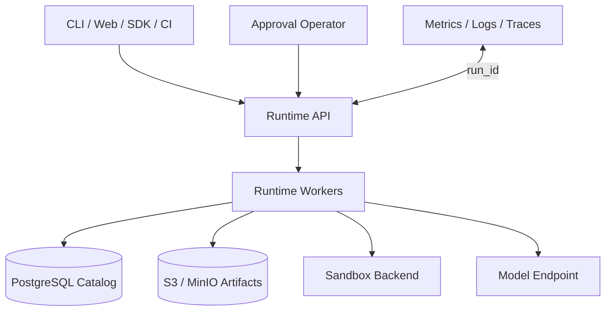

# 生产部署指南

本指南说明如何把 Cody 从单机开发模式部署为多进程 Runtime 服务。它不替代你所在平台的数据库、容器、网络和身份安全规范。

## 推荐拓扑

## 部署模式

| 模式 | Store | Sandbox | 适用范围 |
|---|---|---|---|
| 本地开发 | SQLite + filesystem | Seatbelt/Bubblewrap/local-policy | 单用户单机 |
| 单机服务 | SQLite + filesystem | Docker/Podman | 低并发、单实例 |
| 多进程服务 | PostgreSQL + S3/MinIO | Docker/Podman/Remote | 团队或平台部署 |

SQLite 不应被多个机器共享文件系统并发挂载。需要跨进程协调时使用 PostgreSQL 或实现满足同一 Store 契约的后端。

## 状态与 Worker

- Run、Step、Event、Checkpoint、Approval、Audit 和 Control 写入 durable catalog。
- waiting approval 与 paused Run 不占用 worker。
- worker 取得 Run 后，从最近 checkpoint 恢复 Workflow state 与 sandbox snapshot。
- pause/cancel 通过 Control Store 跨进程传播。
- 所有查询使用稳定 `run_id`，不要依赖进程内对象地址。

## Artifact 分层

小型 metadata 留在 catalog；补丁、测试日志、审查报告、上下文包和 snapshot 等大型 payload 放对象存储。配置：

- tenant/project 前缀
- TLS
- 服务端加密
- 版本控制与生命周期
- 最小权限 bucket policy
- 删除与审计策略

## 安全基线

1. 模型密钥、数据库凭据和云凭据来自 secret manager。
2. Web 内置 API Key 仅是服务鉴权基线；企业身份由外部网关或 Auth extension 提供。
3. Sandbox 默认禁网、fail closed、限制文件根与资源。
4. 自定义 Python 扩展按可信服务代码审查。
5. 高风险 Tool 使用 `confirm`，并保存 actor 与 Approval。
6. 日志、event、artifact 和 audit 在持久化前脱敏。

## 上线前演练

- [ ] 强制终止 worker 后，从另一个进程恢复 Run。
- [ ] 两个无依赖节点真实并发，Join 输出确定。
- [ ] Approval 等待期间 worker 已释放。
- [ ] Quality Gate 失败只执行有限次数返修。
- [ ] Sandbox 禁网、路径拒绝、超时和 process-tree 清理有效。
- [ ] PostgreSQL 跨进程读写和 Control mutation 有效。
- [ ] S3/MinIO 的 prefix、加密、删除和 payload 回填有效。
- [ ] CLI 与 Web 看到相同 timeline。
- [ ] 备份恢复与数据保留策略实际演练。

## Cody 不替你完成的部分

- PostgreSQL 迁移平台、连接池、TLS、备份和高可用。
- S3/MinIO 的部署、bucket policy 和灾备。
- Docker/Podman daemon 与镜像供应链管理。
- Remote Sandbox 的实际 provider transport。
- 企业 OAuth/SSO 产品与组织目录。

这些都可以通过部署配置或 Runtime extension 接入，但不能因为存在接口就视为已交付的托管能力。
