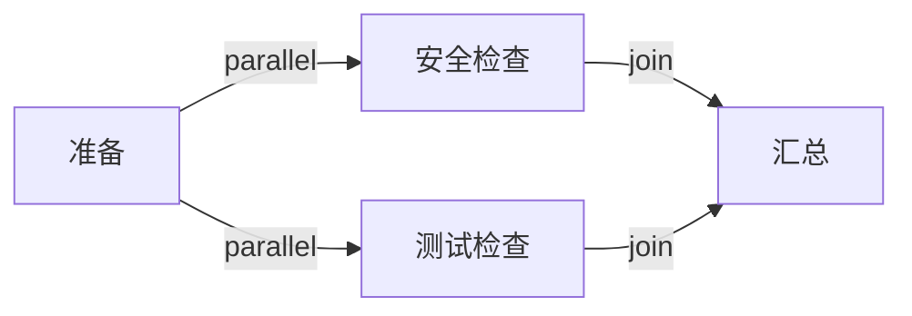

# 05 · 编排并行 Workflow

<div class="tutorial-outcome"><strong>完成后：</strong>你会构建一个真实并发的分支图，在 Join 节点看到确定性合并后的状态。</div>

## 目标图



## 1. 定义 Workflow

```python
from cody.core.runtime import Workflow, WorkflowEdgeType, WorkflowNodeType

workflow = (
    Workflow("parallel-review", workflow_id="workflow_parallel_review")
    .node("prepare", WorkflowNodeType.FUNCTION)
    .node("security", WorkflowNodeType.FUNCTION)
    .node("tests", WorkflowNodeType.FUNCTION)
    .node("join", WorkflowNodeType.FUNCTION)
    .edge("prepare", "security", edge_type=WorkflowEdgeType.PARALLEL)
    .edge("prepare", "tests", edge_type=WorkflowEdgeType.PARALLEL)
    .edge("security", "join", edge_type=WorkflowEdgeType.JOIN)
    .edge("tests", "join", edge_type=WorkflowEdgeType.JOIN)
    .compile()
)
```

条件不是单独的节点类型；它通过 `WorkflowEdgeType.CONDITIONAL` 与命名 condition handler 表达。失败转移使用 `FALLBACK` edge。

## 2. 注册异步节点处理器

```python
import asyncio

from cody import CodyRuntime
from cody.core.runtime import RuntimeStoreBundle


async def function_handler(state, node):
    if node.node_id in {"security", "tests"}:
        await asyncio.sleep(0.1)
        return {node.node_id: {"passed": True}}
    if node.node_id == "join":
        assert "security" in state.data
        assert "tests" in state.data
        return {"verified": True}
    return {"prepared": True}


async def run_workflow() -> None:
    runtime = CodyRuntime(
        runner=object(),
        stores=RuntimeStoreBundle.for_workdir("/tmp/cody-tutorial"),
        node_handlers={"function": function_handler},
        max_concurrency=2,
    )
    try:
        run = await runtime.start(workflow, {"task": "验证项目"})
        result = await run.result()
        print(result.state.data)
    finally:
        await runtime.close()


asyncio.run(run_workflow())
```

`runner=object()` 只因为这个示例全部是 Function 节点；包含 Agent 节点的生产 Runtime 应通过 `CodyRuntime.from_config(...)` 创建真实 runner。

## 3. 理解合并规则

并行分支按 node id 确定性合并。多个节点写同一 key 时必须显式选择：

- `error`：冲突立即失败，最安全。
- `last_write_wins`：按稳定节点顺序覆盖。
- `namespace`：把每个节点的输出放入独立命名空间。

节点 metadata 还可以声明 `timeout_seconds`、`max_retries`、`retry_backoff_seconds` 与 `allow_revisit`。

## 4. 验证真实并发

不要只断言两个节点都完成。记录开始时间或用 barrier 确认 `security` 与 `tests` 同时进入运行态，再验证 Join 只执行一次且拿到两边输出。
