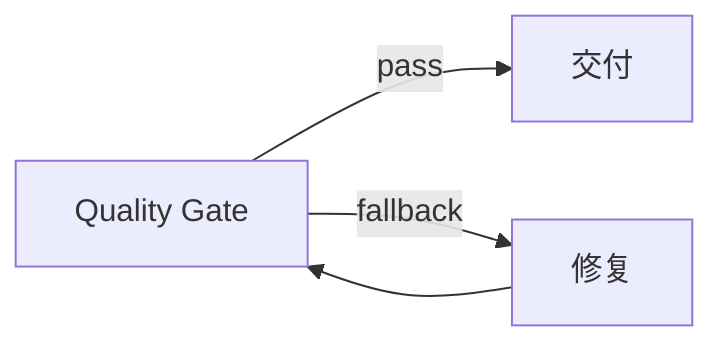

# 08 · Quality Gate 修复循环

<div class="tutorial-outcome"><strong>完成后：</strong>你会让测试失败进入有限次数的返修，并把每次判断保存为结构化 Review Artifact。</div>

## 目标流程



## 1. 定义有界修复图

```python
from cody.core.runtime import Workflow, WorkflowEdgeType, WorkflowNodeType

workflow = (
    Workflow("quality-repair")
    .node(
        "gate",
        WorkflowNodeType.QUALITY_GATE,
        metadata={
            "max_repairs": 2,
            "quality_gate": {
                "gate_id": "tests_gate",
                "metrics": [
                    {
                        "metric_id": "tests",
                        "threshold": 1.0,
                        "required": True,
                    }
                ],
            },
        },
    )
    .node("repair", WorkflowNodeType.AGENT, agent_name="code")
    .node("deliver", WorkflowNodeType.FUNCTION)
    .edge("gate", "deliver")
    .edge(
        "gate",
        "repair",
        edge_type=WorkflowEdgeType.FALLBACK,
        metadata={"allow_revisit": True},
    )
    .edge("repair", "gate", metadata={"allow_revisit": True})
    .compile()
)
```

没有 `allow_revisit` 的回边会在编译期被拒绝；没有 `max_repairs` 的无限返修不是生产级行为。

## 2. 注册命令 Evaluator

```python
from cody.core.runtime import command_evaluator

evaluators = {
    "tests": command_evaluator(
        ("python", "-m", "pytest", "-q"),
        workdir="/tmp/cody-tutorial",
        timeout=300,
    )
}
```

Evaluator 使用 argv 执行，不把不可信参数重新拼接为 shell 字符串。绑定 Sandbox 后，测试、lint 和扫描命令都在同一个 Run execution boundary 内运行。

## 3. 启动 Runtime

```python
from cody import CodyRuntime
from cody.core import Config
from cody.core.runtime import RuntimeBudget, RuntimeStoreBundle

config = Config.load(workdir="/tmp/cody-tutorial")
runtime = CodyRuntime.from_config(
    config,
    "/tmp/cody-tutorial",
    stores=RuntimeStoreBundle.for_workdir("/tmp/cody-tutorial"),
    quality_evaluators=evaluators,
)

run = await runtime.start(
    workflow,
    {"task": "修复测试"},
    budget=RuntimeBudget(max_steps=40, max_duration_seconds=900),
)
result = await run.result()
await runtime.close()
```

## 4. 检查证据

```bash
cody runs metrics <run_id> --workdir /tmp/cody-tutorial
cody artifacts list --run-id <run_id> --workdir /tmp/cody-tutorial
cody timeline show <run_id> --workdir /tmp/cody-tutorial
```

每次 gate decision 都产生事件、checkpoint 和 `REVIEW` Artifact。失败闭环至少同时受以下边界限制：

- `max_repairs`
- 节点 `max_retries`
- Run `max_steps`
- token / cost / duration 预算
- evaluator 自身 timeout
